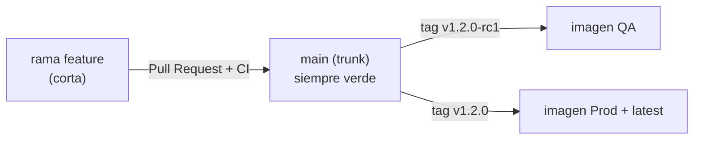

# ci_github_action

App en Python para CI/CD con GitHub Actions.

Es una calculadora mínima expuesta a través de una API en Flask, con pruebas
unitarias y de integración, linting y un pipeline único (`ci-cd.yml`) que separa
las fases de **CI** (lint + pruebas) y **CD** (construir y publicar la imagen
Docker en GHCR), con entornos distintos para QA y producción.

## Estructura del proyecto

```
.
├── app/
│   ├── calculator.py        # sumar / restar / multiplicar / dividir
│   └── main.py              # API Flask (/health, /calculate)
├── tests/
│   ├── test_calculator.py
│   └── test_api.py
├── .github/
│   ├── workflows/
│   │   └── ci-cd.yml        # pipeline: ci, ci-gate, cd-qa/prod, deploy-qa/prod
│   ├── rulesets/
│   │   └── main-protection.json  # ruleset importable para proteger main
│   └── dependabot.yml
├── Dockerfile
├── requirements.txt         # dependencias de runtime (producción)
├── requirements-dev.txt     # runtime + test/lint (incluye al anterior con -r)
└── pytest.ini
```

## Arquitectura del pipeline

El workflow `ci-cd.yml` se dispara con `push` a `main`, `pull_request` a `main`
y tags `v*`. Está compuesto por seis jobs: integración (`ci`), un gate estable
(`ci-gate`), dos de build/push (`cd-qa` y `cd-prod`) y dos de deploy
(`deploy-qa` y `deploy-prod`), encadenados según el tipo de tag.

### Jobs

| Job          | Cuándo corre                                  | Qué hace |
|--------------|-----------------------------------------------|----------|
| `ci`         | Siempre (push, PR y tags)                     | Instala dependencias, corre `flake8` y `pytest` sobre una matriz de Python. Actúa como gate: si falla, no se construye nada. |
| `ci-gate`    | Siempre (`needs: ci`)                         | Job con **nombre estable** que resume el resultado de la matriz. Es el _required status check_ del ruleset de `main`, así no se rompe al cambiar la versión de Python. |
| `cd-qa`      | Solo en tags `v*` que contienen `-rc`         | Construye la imagen y la publica en GHCR con el tag del release candidate más el tag móvil `qa`. **No** mueve `latest`. Environment `qa`. |
| `cd-prod`    | Solo en tags `v*` que **no** contienen `-rc`  | Construye la imagen y la publica en GHCR con el tag de versión y mueve `latest`. Environment `production`. |
| `deploy-qa`  | `needs: cd-qa`                                | **Deploy simulado**: hace `pull` de `:qa`, levanta el contenedor y verifica `/health` (smoke test). Environment `qa`. |
| `deploy-prod`| `needs: cd-prod`                              | **Deploy simulado**: hace `pull` de `:latest`, levanta el contenedor y verifica `/health`. Environment `production`. |

> Los jobs `deploy-*` no usan infraestructura externa: corren la imagen dentro
> del propio runner para validar que el artefacto es desplegable.

### Decisiones de diseño

- **`needs: ci`** en ambos jobs de CD: ninguna imagen se publica si las pruebas
  o el lint fallan.
- **`concurrency` con `cancel-in-progress`**: cancela runs obsoletos del mismo
  ref para dar feedback rápido y no malgastar runners (clave en trunk-based).
- **`ci-gate` como check requerido**: nombre estable independiente de la matriz,
  referenciado por el ruleset de `main`.
- **Environments `qa` y `production`**: aíslan secretos por entorno y permiten
  configurar _required reviewers_ para aprobar manualmente el deploy a prod.
- **Separación QA / Prod por convención de tags**: un tag `-rc` va a QA, un tag
  limpio va a producción. Así se practica un flujo de promoción real
  (`v1.2.0-rc1` → validar → `v1.2.0`).
- **`latest` solo lo controla producción** (`flavor: latest=true` en `cd-prod`,
  `latest=false` en `cd-qa`) para que `latest` nunca apunte a un candidato.
- **Autenticación con `GITHUB_TOKEN`**: usa el token integrado y el permiso
  `packages: write`, sin necesidad de secretos adicionales.

### Protección de `main` (ruleset)

- Pull request obligatorio con al menos 1 aprobación y resolución de hilos.
- _Required status check_: el job **`CI Gate`** debe pasar antes de fusionar.
- Historial lineal y solo merge por **squash** (mantiene el trunk limpio).
- Bloqueo de borrado y de force-push sobre `main`.

> Nota: los _required reviewers_ del environment `production` y el auto-borrado
> de ramas fusionadas se configuran en la UI de GitHub (no son versionables como
> archivo del repo).

## Estrategia de ramas: Trunk-Based Development

Este pipeline está pensado para **trunk-based development**, el modelo de
ramificación que mejor encaja con CI/CD. La idea central es que existe **una
sola rama de larga duración, el _trunk_** (aquí `main`), y todo el equipo
integra su trabajo ahí de forma frecuente.

### Cómo funciona

- **`main` siempre desplegable**: cada commit en `main` debe poder ir a
  producción. Por eso el job `ci` corre en cada `push` y `pull_request`: si el
  lint o las pruebas fallan, el cambio no entra.
- **Ramas de feature muy cortas**: se crean ramas pequeñas a partir de `main`,
  viven horas o pocos días y se fusionan rápido mediante un Pull Request. No hay
  ramas `develop`, `release` ni `hotfix` de larga vida (eso es Git Flow, el
  enfoque opuesto).
- **Integración continua de verdad**: al fusionar seguido y en porciones
  chicas, los conflictos son mínimos y el feedback es inmediato.
- **Releases por tags, no por ramas**: la promoción a QA y producción se hace
  etiquetando un commit de `main`, no creando ramas de release. Un tag `-rc`
  (ej. `v1.2.0-rc1`) dispara la imagen de **QA** y un tag limpio (ej. `v1.2.0`)
  la de **producción**. El historial lineal de `main` es la única fuente de
  verdad.

### Flujo típico



### Por qué este modelo y no Git Flow

| Tema                | Trunk-Based (este repo)          | Git Flow |
|---------------------|----------------------------------|----------|
| Ramas largas        | Solo `main`                      | `main`, `develop`, `release/*`, `hotfix/*` |
| Vida de una feature | Horas / días                     | Días / semanas |
| Releases            | Por tags sobre `main`            | Por ramas `release/*` |
| Conflictos de merge | Pocos (integración frecuente)    | Más frecuentes y grandes |
| Encaje con CI/CD    | Natural                          | Requiere más coordinación |

> Buenas prácticas que acompañan a trunk-based: PRs pequeños, revisión rápida,
> protección de rama en `main` (exigir que el job `ci` pase antes de fusionar) y
> uso de _feature flags_ para esconder trabajo incompleto en lugar de mantenerlo
> en ramas aparte.

## Ejecutar en local

```bash
python -m venv .venv
source .venv/bin/activate
pip install -r requirements-dev.txt

# ejecutar la app
python -m app.main          # http://localhost:5000/health

# lint + pruebas (igual que CI)
flake8 app tests
pytest
```

## Probar la API

```bash
curl http://localhost:5000/health

curl -X POST http://localhost:5000/calculate \
  -H "Content-Type: application/json" \
  -d '{"op": "sumar", "a": 2, "b": 3}'
```
